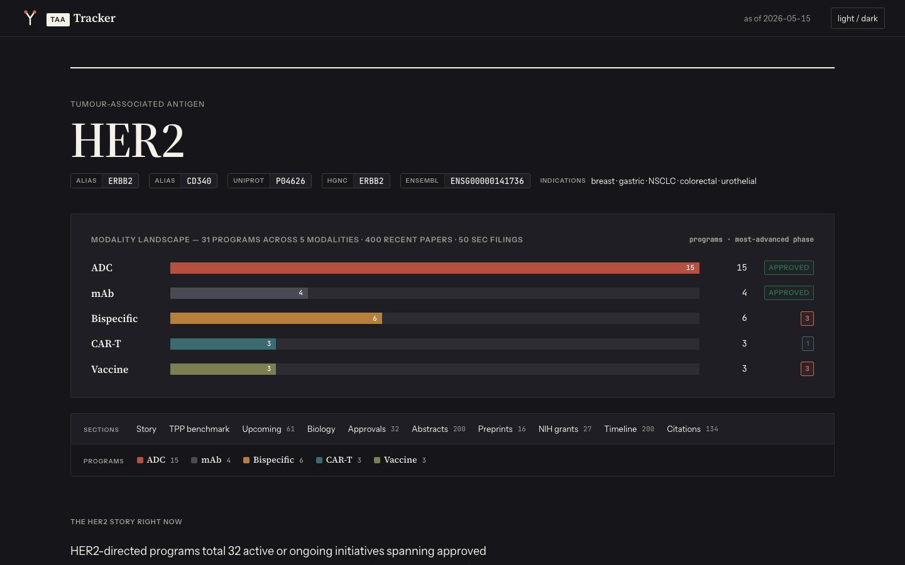

# TAA Tracker

A citation-grounded scorecard pipeline for tumor-associated antigen drug programs, built from 11 public biotech data sources for biotech BD and corp-dev readers.

**Author.** Rohit Singla, rsingla@ece.ubc.ca, [LinkedIn](https://www.linkedin.com/in/rsingla92/)

```
    ┌──────────────────────────────────────────────────────────────┐
    │ Can 11 scattered public biotech feeds resolve into           │
    │ one scorecard a BD analyst can actually trust?               │
    │                                                              │
    │ sources  CT.gov, PubMed, OpenAlex, EDGAR, Open Targets,      │
    │          News RSS, Europe PMC, NIH RePORTER, openFDA, EMA    │
    │               │                                              │
    │               ▼                                              │
    │         alias match (longest-substring,                      │
    │         cross-antigen guard)                                 │
    │               │                                              │
    │               ▼                                              │
    │         exclude rules (curated false-positive filter)        │
    │               │                                              │
    │               ▼                                              │
    │         modality lookup (curated YAML)  ──▶  Program         │
    │               │                                              │
    │               ▼                                              │
    │         citation-grounded LLM synthesis                      │
    │         (strict JSON, validated against real citation IDs)   │
    │               │                                              │
    │               ▼                                              │
    │         snapshot DB (SQLite, content-hash dedupe)            │
    │               │                                              │
    │               ▼                                              │
    │         static HTML scorecard, per antigen + index           │
    │                                                              │
    │   Every Program carries citation_ids + trial_ncts.           │
    │   No valid citation -> the sentence is dropped, not shown.   │
    └──────────────────────────────────────────────────────────────┘
```

## Table of contents

- [What it looks like](#what-it-looks-like)
- [Current status](#current-status)
- [How this project came about](#how-this-project-came-about)
- [What this project is](#what-this-project-is)
- [How this project was built, and how I used AI tools](#how-this-project-was-built-and-how-i-used-ai-tools)
- [Why cross-source antigen tracking is a real problem](#why-cross-source-antigen-tracking-is-a-real-problem)
- [How the pipeline is designed](#how-the-pipeline-is-designed)
- [Data sources](#data-sources)
- [Results so far](#results-so-far)
- [What is still open](#what-is-still-open)
- [If you are skimming, look at these](#if-you-are-skimming-look-at-these)
- [Repository layout](#repository-layout)
- [How to reproduce](#how-to-reproduce)
- [License](#license)

## What it looks like

<details>
<summary><strong>HER2 scorecard header: the modality cross-cut grid</strong></summary>

The modality cross-cut grid is the signature visual element on every antigen page, shown before any data table: program counts and most-advanced phase per modality (ADC, mAb, bispecific, CAR-T, vaccine), plus jump-to-section navigation. HER2 is the anchor antigen, live at `dist/her2.html` after running `taa-refresh`.



</details>

## Current status

- 7 antigens live: HER2, BCMA, CLDN18.2, B7-H3, 5T4, ROR1, B7-H4.
- 11 source integrations running, each behind its own async rate-limit semaphore, degrading to a stale-source banner rather than a crash if one API is down.
- Citation-grounded LLM synthesis and fail-closed validation: live on every antigen.
- Snapshot DB, upcoming-catalysts view, and historic timeline (v0.3): live.
- TPP benchmark layer: curated for 5 of 7 antigens. 5T4 and B7-H4 aren't curated yet.
- Automated test suite: not started. `pytest` is configured in `pyproject.toml`; no test files exist yet.
- Last data refresh: 2026-05-15.

## How this project came about

I kept running into the same problem doing biotech BD work: the picture of "who's developing what against this target" is scattered across a dozen sites that don't talk to each other. ClinicalTrials.gov has the trials, EDGAR has the corporate disclosure, PubMed and preprint servers have the biology, and none of them agree on what to call a drug. I wanted to know whether an LLM-assisted pipeline could stitch that together into something trustworthy enough to actually use, not a demo that looks good until you check the citations. HER2 was the first target because it's the most heavily trafficked tumor-associated antigen in oncology and a good stress test for the alias-matching logic before scaling to less common targets.

## What this project is

TAA Tracker pulls trial, publication, filing, approval, and grant data for a curated list of tumor-associated antigens from 11 free public APIs, normalizes it into per-drug program records, and renders a static HTML scorecard per antigen plus a cross-antigen index. Each scorecard includes the modality cross-cut grid shown above, a TPP benchmark comparison where curated, an LLM-written narrative synthesis where every claim traces back to a source citation, an upcoming-catalysts panel, and a historic timeline. The whole thing runs as a single CLI command (`taa-refresh`) intended to be cron-scheduled.

| Slug | Antigen | Why it's interesting |
| --- | --- | --- |
| `her2` | [HER2](https://en.wikipedia.org/wiki/HER2) / ERBB2 | The most heavily-trafficked oncology TAA. Anchor for the cross-cut UX. |
| `bcma` | [BCMA](https://en.wikipedia.org/wiki/B-cell_maturation_antigen) / TNFRSF17 | Heme. Two approved CAR-Ts (Carvykti, Abecma) + Tecvayli bispecific. |
| `cldn18-2` | [CLDN18.2](https://en.wikipedia.org/wiki/Claudin_18) | Hot post-zolbetuximab approval. Rapidly developing ADC + bispecific tier. |
| `b7-h3` | [B7-H3](https://en.wikipedia.org/wiki/CD276) / CD276 | Pan-cancer ADC race (DS-7300, MGC018, HS-20093) + paediatric CAR-T. |
| `5t4` | 5T4 / TPBG | Thin clinical pipeline, academic-heavy preclinical: preprints and grants matter more than trials. |
| `ror1` | [ROR1](https://en.wikipedia.org/wiki/ROR1) | Zilovertamab vedotin (Merck) anchors. CAR-T tier growing (Lyell, Oncternal). |
| `b7-h4` | B7-H4 / VTCN1 | Breast/ovarian/endometrial ADC race (AZD8205, XMT-1660, FPA150). Naming overlaps B7-H3, which makes alias matching the gotcha. |

Add an antigen by appending to `data/antigens.yaml` and re-running `taa-refresh`.

## How this project was built, and how I used AI tools

I built and ran this solo, owning the pipeline end to end: which data sources to trust, how to resolve entity collisions between programs that share sponsors and combination trials, what an LLM is and isn't allowed to assert about a citation, and when a missing result (no synthesis, no TPP, no catalyst) is more honest than a filled-in guess. Claude Code was my execution collaborator across most of the build, and every source client, schema, and template went through my review before landing on `main`.

**I owned:** the normalization rules (which aliases need exclude terms, the cross-antigen guard, the longest-substring match), the curated data (`drug_modality.yaml`, `antigens.yaml`, TPP benchmarks, the conference calendar), the citation-grounding contract for the LLM layer, the precision-over-recall call on catalyst extraction, and the design system in `DESIGN.md`.

**Claude Code accelerated:** the 11 async source clients (broadly similar retry/semaphore/pagination shapes once the first one was right), the Pydantic schema boilerplate, and the Jinja2 template scaffolding.

Most of the real work here wasn't writing source clients. It was deciding what the pipeline is allowed to assert on its own versus what needs a curated rule or a human check, and doing that close enough to the domain that a BD reader can trust what's on the page without reading the code. That's the same call a forward-deployed or applied engineer makes constantly: an ambiguous, messy real-world problem with no clean API, and a system that has to hold up in use, not just demo well.

## Why cross-source antigen tracking is a real problem

Paid competitive-intelligence platforms in biotech (Cortellis, GlobalData, Evaluate) already do a version of cross-source program tracking, but they're expensive, opaque about methodology, and slow to add newer or less-trafficked targets. The free public sources behind them, CT.gov, PubMed, EDGAR, and the rest, are individually open, but nobody stitches them together for free, and each one names drugs and sponsors differently enough that a naive join produces a mess.

The underlying problem has a name: [entity resolution](https://en.wikipedia.org/wiki/Record_linkage), deciding when two records from different systems refer to the same real-world thing. At production scale the standard answer is curated lookup tables plus a human-in-the-loop review step, not an open-vocabulary matcher, because an unreviewed false match is unacceptable when the output feeds a business decision. This project follows that pattern: alias matching against a curated table, explicit per-antigen exclude rules, and unresolved names surfaced for a person to categorize instead of guessed at by a model.

None of that is new science. It's the same curation-heavy discipline applied to a useful open dataset nobody had bothered to assemble for free. What's less standard is the LLM synthesis layer, where citation-grounding is enforced as a hard schema constraint: every model-generated sentence gets checked against the real source-derived citation set before it's allowed to render, instead of trusting the model's self-reported citations. That only became practical with production-grade structured-output APIs, and it's the piece of this pipeline I'd point to as the real engineering bet.

## How the pipeline is designed

**Alias matching is longest-substring with a cross-antigen guard, not exact match.** An early version matched on first hit, which meant a short generic term like "CAR-T" could swallow a longer, more specific drug name before the specific match was tried. It's longest-match now. There's also an explicit guard that drops a match if the matched drug is registered to a *different* antigen than the one being processed, because combination trials cross-contaminate otherwise: HS-20093 and HS-20089 are both Hansoh B7-H3/B7-H4 ADCs that co-appear in the same combination trials, and without the guard, HS-20093 leaks into the B7-H4 scorecard and vice versa.

**Exclude rules are a curated per-antigen false-positive filter**, applied after the alias match and before modality assignment. Some aliases are short enough to false-positive against unrelated trials (`data/antigens.yaml` notes that HER2's "NEU" alias, if kept, would match neurology, neuroendocrine, and neutropenia trials that have nothing to do with the antigen). Antigens with unambiguous long aliases (ERBB2) don't need exclude terms at all; this is a per-antigen decision, not a global one.

**Modality is assigned from a curated YAML lookup table, not inferred.** Drug names that don't match anything in `data/drug_modality.yaml` are collected as unknowns rather than guessed at, and surfaced through `taa-audit-matches` for one-keypress human categorization. That lookup table and each antigen's `exclude_terms` are the trust layer, both hand-curated, and they're the real bottleneck for adding antigens past the current 7.

**LLM synthesis is citation-grounded by schema, not by prompt instruction alone.** The model doesn't see raw trial text; it sees pre-summarized program rollups and a citation list restricted to IDs actually referenced by those programs. Every output sentence carries a `citation_ids` field, and a post-hoc validation step drops any sentence whose citation isn't in the real, source-derived citation set (`validate_against_citations` in `taa/synth.py`). If the API call fails, the JSON doesn't parse, or Pydantic validation fails, the synthesis is omitted entirely rather than shown partially wrong.

**Catalyst date extraction is regex, not LLM**, and deliberately trades recall for precision. It requires a data-signal keyword (topline, interim, primary endpoint, data readout, results) within 80 characters of a trigger word (expected, anticipated, by, in) followed by a parseable date phrase. Phrasing outside that pattern, like "on track for Q3" or "will report results in," is silently missed. A wrong catalyst date is worse than a missing one for a BD reader making a calendar decision.

**The snapshot database dedupes on a content hash, not a source-native ID.** Each timeline event is hashed from its kind, date, truncated lowercase title, and query-stripped URL. RSS items and API records don't have stable IDs across refreshes, or the ID scheme differs per source, so a content hash is what makes "is this the same event I saw last refresh" answerable at all.

**Scale.** A full refresh processes the 7 antigens sequentially; within each antigen, 9 of the 11 sources fetch concurrently under source-specific semaphores (5 req/s for CT.gov, 3 req/s for PubMed without an NCBI key, down to 2 req/s for NIH RePORTER out of courtesy to a single-tenant API). openFDA and EMA run afterward per antigen, since both query against the antigen's already-resolved drug list.

## Data sources

Every source is free, public, and rate-limit-respectful. Each has its own asyncio semaphore matched to its published or reasonable-courtesy limit; failures degrade gracefully.

| Source | Stream | Concurrency cap | Why it matters |
| --- | --- | --- | --- |
| [CT.gov v2](https://clinicaltrials.gov/data-api/api) | Trials | 5 | Ground-truth clinical pipeline. |
| [PubMed](https://www.ncbi.nlm.nih.gov/home/develop/api/) (E-utilities) | Papers | 3 (10 with an NCBI API key) | Canonical bibliographic record, peer-reviewed signal. |
| PubMed conference abstracts | Abstracts | 3 (10 with an NCBI API key) | ASCO / AACR / ESMO / SITC / ASH supplements, readouts ahead of publication. |
| [OpenAlex](https://openalex.org/) | Papers + citation counts | 8 | Momentum signal (cites/year). |
| [EDGAR](https://www.sec.gov/edgar) | SEC filings | 8 | 10-K / 8-K corporate disclosure of programs. |
| [Open Targets](https://www.opentargets.org/) | Biology | 5 | Druggability, tractability, top diseases, safety liabilities. |
| News RSS | Press releases | 8 | Real-time deal / IND / readout coverage. |
| [openFDA](https://open.fda.gov/) Drugs | FDA approvals | 8 | NDA / BLA ground truth. |
| [EMA EPAR](https://www.ema.europa.eu/en/medicines) | EU approvals | n/a | Marketing authorisation cross-check. |
| [Europe PMC](https://europepmc.org/) preprints | bioRxiv / medRxiv | 6 | Leading indicator, 6-18 months ahead of PubMed. |
| [NIH RePORTER](https://reporter.nih.gov/) | US-funded grants | 2 | Academic preclinical / translational pipeline (NCI, NHLBI, NIAID, NIDDK). |

## Results so far

### v0.1: HER2 vertical slice (2026-05-02)

First end-to-end scorecard: HER2 from CT.gov, 4 sources, 3 antigens (HER2, BCMA, CLDN18.2), the v1 editorial design system, and the `audit-matches` curation tool. It's what proved the normalization approach held up against a heavily-trafficked, name-collision-prone target.

### v0.2: scale to 11 sources, 6 antigens (2026-05-07)

Added Europe PMC preprints and NIH RePORTER grants, plus B7-H3, 5T4, and ROR1. The cross-antigen guard stopped being theoretical here: B7-H3 and B7-H4 share sponsors and combination trials, and the naive alias match leaked programs across antigen pages until the guard was added.

### v0.3: snapshot DB, catalysts, timeline (2026-05-15)

Added the SQLite snapshot database, the upcoming-catalysts view, the historic timeline, and B7-H4 as a seventh antigen.

### What I learned so far

- Free-form "cite your sources" prompting isn't enough on its own. The synthesis contract needed a hard structural check, which is why `taa/synth.py` validates every returned citation ID against the real citation set and drops anything that doesn't match, rather than trusting the model's self-reported citations.
- Alias matching on first-hit was wrong. Short generic modality terms would match before the specific drug did, so match order had to change to longest-string-wins.
- Combination trials break naive per-antigen matching. Two drugs from the same sponsor's combination trial for related targets will cross-contaminate each other's antigen pages unless there's an explicit guard rejecting a drug registered to a different antigen than the one currently being processed.
- Automating modality assignment looked tempting but would have traded a small amount of manual curation time for an unbounded amount of silent misclassification risk, so it stayed a curated lookup table with unknowns explicitly surfaced for a human to categorize.
- Catalyst-date guidance in news text is one of the least standardized things to parse. Rather than chase every phrasing variant with an LLM and inherit its hallucination risk for something as consequence-bearing as a date, the extractor stays regex-based and conservative, and simply omits catalysts it isn't confident about.

## What is still open

- No automated test suite yet. Priority order once started would be `taa/normalize.py` (alias/exclude/guard logic) and `taa/synth.py` (citation validation), since regressions there are the hardest to notice from the rendered output alone.
- TPP curation gap: 5T4 and B7-H4 don't have a benchmark yet.
- **v0.4**: snapshot diffs, "what changed since last refresh" per antigen. The snapshot DB already has what's needed; it's a diff query and a render away.
- **v0.5**: cross-antigen whitespace heatmap (antigens x modalities, highlighting cells where Open Targets tractability is high but the clinical column is empty).
- **v0.6**: scale to 25-50 antigens with client-side search and modality/indication filters on the index page.
- **v0.7+**: LLM-based readout-date extraction to replace the regex, investor-deck PDF extraction, a real test suite, weekly digest email.

## If you are skimming, look at these

Five files worth opening if you want to see how the pipeline actually works.

1. **[`taa/schema.py`](taa/schema.py)** (505 lines). The data contracts. Closed-vocabulary `Literal` types and required citation IDs are what keep bad data from propagating downstream.
2. **[`taa/normalize.py`](taa/normalize.py)** (276 lines). Alias matching, exclude rules, and modality assignment, the entity-resolution trust layer described above.
3. **[`taa/synth.py`](taa/synth.py)** (258 lines). The citation-grounded LLM synthesis layer: strict JSON output, and a post-hoc validation step that drops any sentence whose citation isn't in the real citation set.
4. **[`taa/catalysts.py`](taa/catalysts.py)** (414 lines). The regex-based, precision-over-recall catalyst date extractor.
5. **[`taa/snapshots.py`](taa/snapshots.py)** (277 lines). The content-hash SQLite dedupe behind the historic timeline.

## Repository layout

```
DESIGN.md                   Design system source of truth
LICENSE                      MIT
CHANGELOG.md                 Version history
taa/
  schema.py                  Pydantic data contracts
  normalize.py                Alias matching, exclude rules, modality lookup
  synth.py                    Citation-grounded LLM synthesis + validation
  catalysts.py                Regex-based upcoming-catalyst extraction
  snapshots.py                 SQLite snapshot DB, content-hash dedupe
  render.py                   Jinja2 -> static HTML
  audit_matches.py             Interactive drug-name curation tool
  cli.py                       taa-refresh / taa-audit / taa-audit-matches entry points
  sources/                     One async client per data source (11 total)
templates/ + static/         Design system templates + system.css
data/
  antigens.yaml               Curated TAA universe (7 antigens)
  drug_modality.yaml           Drug name -> modality lookup (hand-curated)
  conferences.yaml             Curated oncology meeting calendar
  tpp/*.yaml                   Curated Target Product Profiles (5 of 7 antigens)
  snapshots.db                 SQLite snapshot history (committed)
  {slug}.json                  Per-antigen refreshed output (7 files)
```

## How to reproduce

Requires Python 3.11+.

```bash
git clone git@github.com:rsingla92/taa-tracker.git
cd taa-tracker
python -m venv .venv
source .venv/bin/activate
pip install -e ".[dev]"
cp .env.example .env
# edit .env: ANTHROPIC_API_KEY (required for synthesis), NCBI_API_KEY (optional,
# raises PubMed rate limit from 3 req/s to 10 req/s), EDGAR_USER_AGENT (required
# by SEC EDGAR, e.g. "Your Name your-email@example.com")

taa-refresh              # full pipeline: fetch, normalize, synthesize, render
open dist/index.html
```

```bash
taa-audit                # coverage audit against curated drug lists
taa-audit-matches        # interactive curation of unrecognized drug names
```

## License

[MIT](LICENSE).
